# 🏛️ GeM CompliFlix — SIH 2026 Platform Technical Documentation
> **Autonomous AI/ML Tender Compliance, Fraud Detection, Forensic Document Verification & RAG Intelligence System**
> **Compliant with:** GFR 2017, GeM GTC v4.0, DPIIT Make in India, Rule 144(xi), and MSME Public Procurement Policy 2012.
## **Testing Credientials**:
> **Bidder:** <br/> username: rajatsre455@gmail.com password:Rajat@123 <br/>
> **Officer:** <br/> username: vanshsharma0963@gmail.com password: Vansh@123
---

## 📑 Table of Contents
1. [Executive Summary & Problem Statement](#1-executive-summary--problem-statement)
2. [High-Level System Architecture](#2-high-level-system-architecture)
3. [User Personas & Role-Based Access Control (RBAC)](#3-user-personas--role-based-access-control-rbac)
4. [End-to-End Data Flow Architecture (DFD)](#4-end-to-end-data-flow-architecture-dfd)
   - [Level 0: Context Data Flow Diagram](#level-0-context-data-flow-diagram)
   - [Level 1: System-Wide Process Decomposition](#level-1-system-wide-process-decomposition)
   - [Level 2: Subsystem Deep Dive (Bid Evaluation & ML Verification)](#level-2-subsystem-deep-dive)
5. [Process Workflows & Sequence Diagrams](#5-process-workflows--sequence-diagrams)
   - [5.1A: Procurement Officer Authentication & DigiLocker Flow](#51a-procurement-officer-authentication--digilocker-flow)
   - [5.1B: Commercial Bidder Registration & Onboarding Flow](#51b-commercial-bidder-registration--onboarding-flow)
   - [5.2: Tender Upload, Cloudinary Storage & Vector Ingestion](#52-tender-upload-cloudinary-storage--vector-ingestion)
   - [5.3: Forensic ML Verification & Dynamic CIS Engine](#53-forensic-ml-verification--dynamic-cis-engine)
   - [5.4: Contextual RAG Chatbot Pipeline (Gemini + pgvector)](#54-contextual-rag-chatbot-pipeline)
   - [5.5: Automated Single-Click Clearance & QCBS Ranking](#55-automated-single-click-clearance--qcbs-ranking)
6. [Frontend Client Architecture & UI Subsystem](#6-frontend-client-architecture--ui-subsystem)
   - [Client Component Hierarchy & Design Tokens](#61-client-component-hierarchy--design-tokens)
   - [DocumentPreviewModal & Forensic Inspection](#62-documentpreviewmodal--forensic-inspection)
   - [Real-Time Bid Submission & Officer Evaluation Bridge](#63-real-time-bid-submission--officer-evaluation-bridge)
   - [State Management & Context Providers](#64-state-management--context-providers)
7. [Machine Learning & Forensic Architecture](#7-machine-learning--forensic-architecture)
8. [Vector Database & Generative AI RAG Architecture](#8-vector-database--generative-ai-rag-architecture)
9. [Database Schema & Entity-Relationship (ER) Diagram](#9-database-schema--entity-relationship-er-diagram)
10. [Consolidated API Catalog & Endpoints](#10-consolidated-api-catalog--endpoints)
11. [Statutory Compliance & Regulatory Rules Engine](#11-statutory-compliance--regulatory-rules-engine)
12. [Deployment, Infrastructure & Security](#12-deployment-infrastructure--security)
13. [Testing, Verification & Quality Assurance Suite](#13-testing-verification--quality-assurance-suite)

---

## 1. Executive Summary & Problem Statement

### 1.1 The Challenge in Public Procurement
Government procurement across India via **GeM (Government e-Marketplace)** processes hundreds of thousands of tenders annually worth billions of dollars. However, procurement officers and public institutions face significant operational risks:
1. **Document Forgery & Tampering**: Submissions often contain manipulated balance sheets, counterfeit GST returns, tampered CA certificates, or cloned UDIN/Udyam certificates.
2. **Cartelization & Bid Rigging**: Unethical syndicates deploy shell entities with common ownership, collusive pricing patterns, or shared digital footprints to manipulate L-1 pricing.
3. **Manual Compliance Bottlenecks**: Scrutinizing complex 100+ page tender documents and cross-referencing statutory compliance (GFR 2017, Rule 144(xi) Land Border restrictions, Make in India thresholds, and MSME/Startup exemptions) takes days per bid.
4. **Information Asymmetry**: Bidders struggle to understand intricate tender clauses, leading to unintentional disqualifications or non-compliance.

### 1.2 The Solution: GeM CompliFlix
**GeM CompliFlix** is an enterprise-grade, end-to-end intelligent procurement governance suite built for **SIH 2026**. It unifies:
- **Dual Portal UI**: Dedicated interfaces for Procurement Officers and Commercial Bidders.
- **Multi-Stage Forensic ML Engine**: Automated OCR, cryptographic signature validation (pyHanko), QR code decoding (pyzbar), Mod-36 GSTIN verification, and Random Forest qualification predictors.
- **Dynamic CIS (Compliance Integrity Score) Engine**: Continuous 0.0–1.0 index weighted across 18 Indian procurement document categories.
- **Google Gemini RAG + pgvector**: Contextual conversational intelligence for instant clause interpretation, multi-bidder comparison, and tender requirement matching.
- **Single-Click Clearance & QCBS Ranking**: Quality and Cost Based Selection, GFR 173(i) MSE/Startup automated exemptions, and audit trails.

---

## 2. High-Level System Architecture

The platform follows a **clean, 4-tier layered architecture** with strictly defined boundaries:

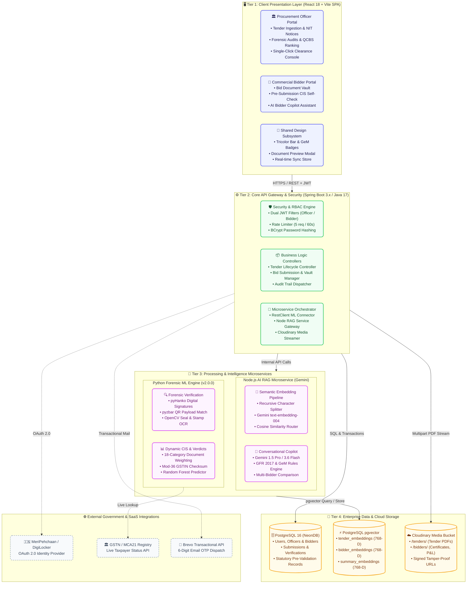

---

## 3. User Personas & Role-Based Access Control (RBAC)

The application enforces strict separation of concerns via dual JWT authentication tokens and filter chains:

| Attribute | Procurement Officer | Commercial Bidder | Public / Visitor |
| :--- | :--- | :--- | :--- |
| **Role Identifier** | `ROLE_OFFICER` | `BIDDER` | Unauthenticated |
| **Primary Identifier**| Employee ID (`EMP101`) + Dept Email | Company GSTIN + Official Email | Anonymous |
| **Identity Verification**| DigiLocker / MeriPehchaan + Gov Database | GSTIN / PAN Mod-36 + Brevo Email OTP | None |
| **Allowed Actions** | • Upload & publish tenders<br/>• Run batch ML forensic audits<br/>• View tamper reports & signatures<br/>• Inspect AI multi-bidder comparison<br/>• Issue Single-Click Clearances<br/>• Evaluate QCBS score & L1 awards | • Browse active published tenders<br/>• Upload compliance vault documents<br/>• Run pre-submission CIS audit<br/>• Query Bidder AI Copilot<br/>• Submit bids with quoted prices<br/>• Track real-time evaluation status | • Browse public tenders<br/>• View tender notices & dates<br/>• Read platform documentation |
| **Security Filters** | `OfficerAuthTokenFilter` (`/api/officer/**`) | `BidderAuthTokenFilter` (`/api/bidder/**`)| `WebMvcCorsConfig` (PermitAll `/tenders`) |

---

## 4. End-to-End Data Flow Architecture (DFD)

### Level 0: Context Data Flow Diagram
A clean hub-and-spoke view illustrating boundary interactions:

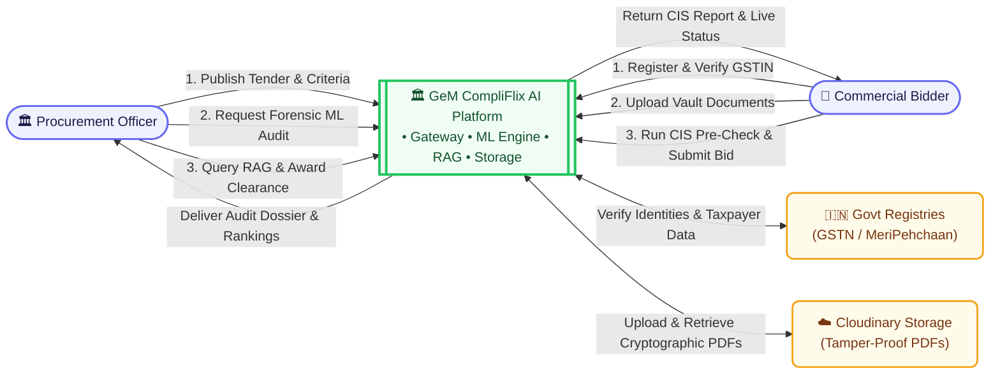

---

### Level 1: System-Wide Process Decomposition
Decomposing the platform into its 5 primary operational stages:

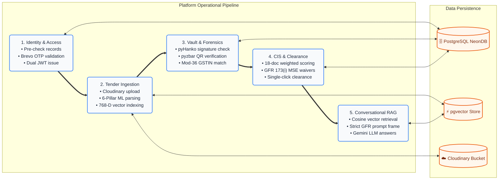

---

### Level 2: Subsystem Deep Dive (Bid Evaluation & ML Verification)
Detailed, clean three-phase execution flow inside the forensic engine:

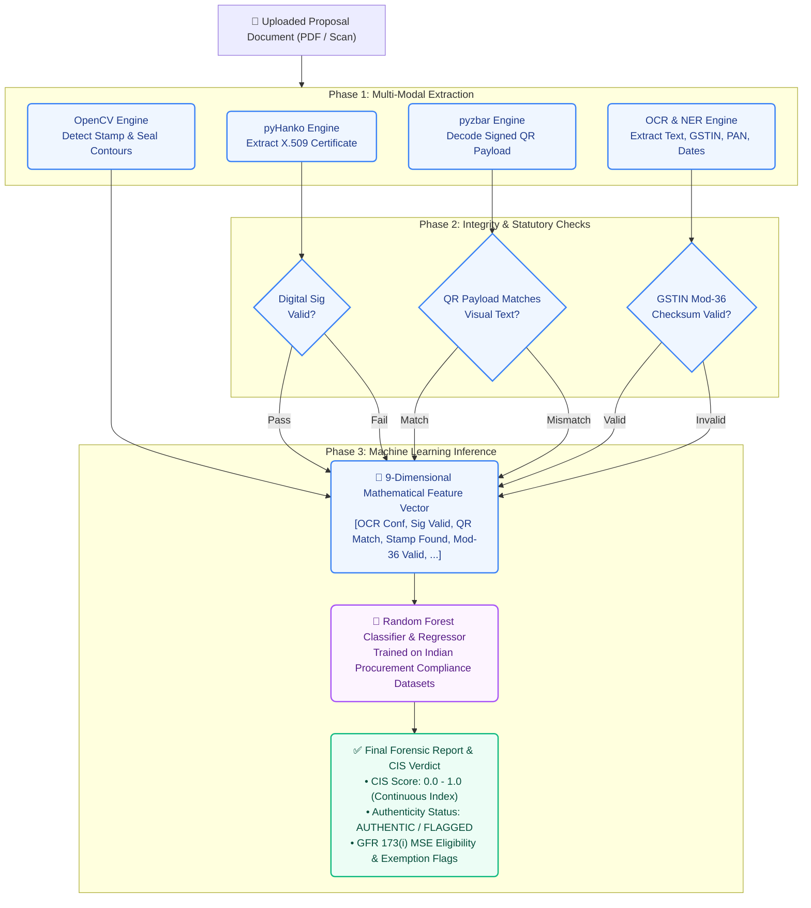

---

## 5. Process Workflows & Sequence Diagrams

### 5.1A: Procurement Officer Authentication & DigiLocker Flow

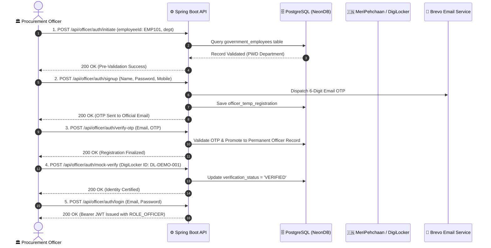

---

### 5.1B: Commercial Bidder Registration & Onboarding Flow

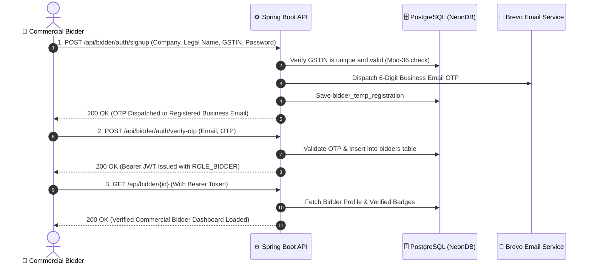

---

### 5.2: Tender Upload, Cloudinary Storage & Vector Ingestion

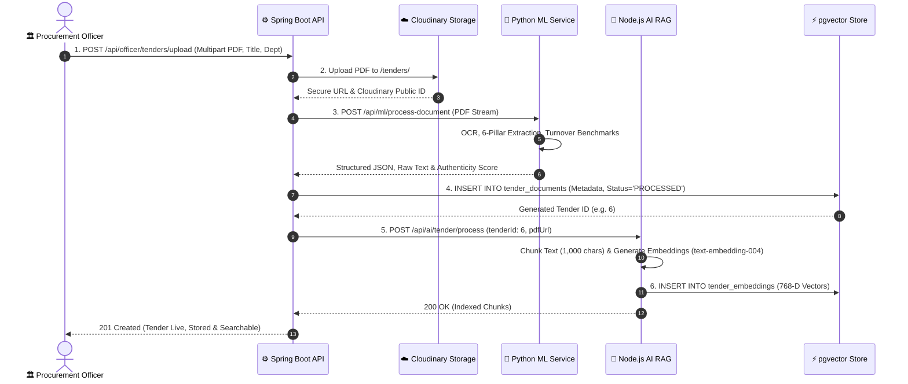

---

### 5.3: Forensic ML Verification & Dynamic CIS Engine

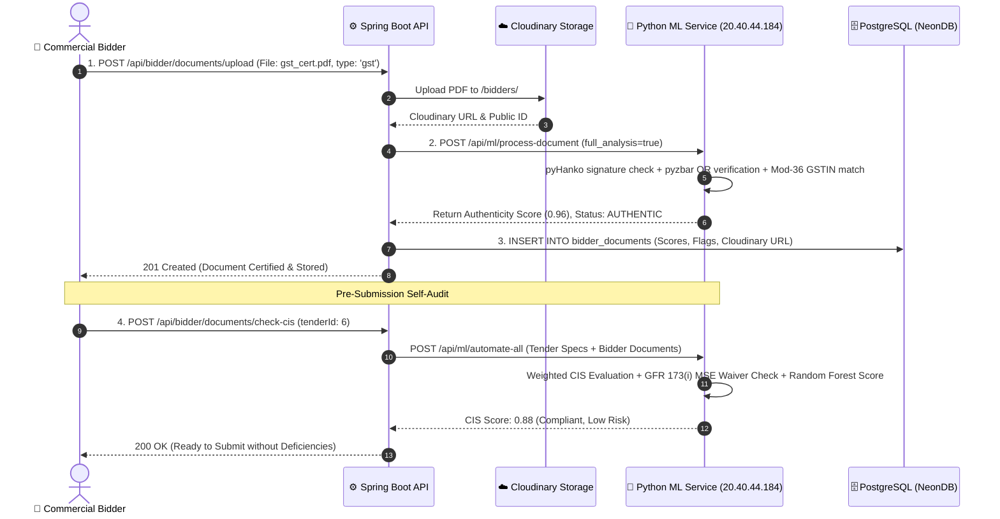

---

### 5.4: Contextual RAG Chatbot Pipeline

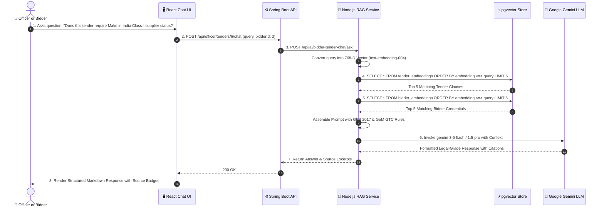

---

### 5.5: Automated Single-Click Clearance & QCBS Ranking

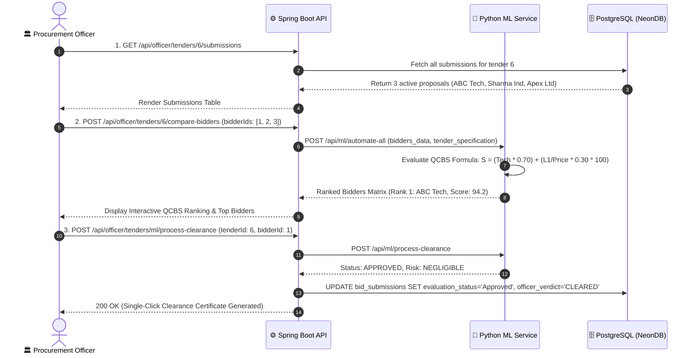

---

## 6. Frontend Client Architecture & UI Subsystem

The Client is built on **React 18** and bundled with **Vite**, adhering to modern Government of India digital design standards (NIC, Digital India, and GeM Compliance branding).

### 6.1 Client Component Hierarchy & Design Tokens
```
Client/src/
├── components/
│   ├── common/
│   │   ├── Navbar.jsx & Footer.jsx (Tricolor accents & National Emblem)
│   │   ├── DocumentPreviewModal.jsx (Class-3 DSC & Section 65B Certificate Viewer)
│   │   ├── BidderChatBot.jsx & ChatBox.jsx (Contextual AI Assist)
│   │   └── MarkdownRenderer.jsx (Clean legal citation rendering)
│   ├── tender/
│   │   ├── TenderCard.jsx & TenderDetailModal.jsx
│   │   ├── AiEvaluationDrawer.jsx (Side-by-side proposal review)
│   │   ├── ProcurementClearanceModal.jsx (One-click statutory approval)
│   │   └── TopBiddersSection.jsx & QcbsBiddersRanking.jsx
│   └── documents/
│       ├── DocumentUploader.jsx (Drag-and-drop multipart uploader)
│       └── DocumentUploadModal.jsx
├── pages/
│   ├── Dashboard/
│   │   ├── TenderSubmissionsView.jsx (Officer Master Evaluation Queue)
│   │   ├── OfficerUploadExtractView.jsx (Tender parsing view)
│   │   ├── BidderDashboard.jsx (Bidder vault and live analytics)
│   │   └── TopBiddersView.jsx
│   ├── MyApplications/
│   │   └── MyApplications.jsx (Bidder application status & tracking)
│   ├── Audit/
│   │   └── AuditTrail.jsx (Tamper-evident system activity log)
│   └── Verification/
│       └── Verification.jsx (Forensic document review)
├── services/
│   ├── api.js (Axios instance with Bearer JWT interceptors)
│   ├── authService.js (Dual role signup/login & DigiLocker)
│   ├── documentViewerService.js (jsPDF dynamic certificate generator)
│   └── mlService.js & aiService.js
└── store/
    ├── slices/ (authSlice, dashboardSlice, tenderSlice, uiSlice)
    └── index.js (Redux Toolkit root store)
```

### 6.2 DocumentPreviewModal & Forensic Inspection
The `DocumentPreviewModal` component provides an enterprise-grade document inspection interface:
1. **Document Preview Tab**: Renders native PDFs inside a sandboxed `iframe` or responsive image viewer, supporting full-screen inspection, printing, and direct file download.
2. **Forensics & DSC Stamp Tab**:
   - Displays Section 65B Indian Evidence Act certification status.
   - Shows Class-3 Digital Signature Certificate (DSC) verification details.
   - Displays computed **SHA-256 Digest Token** with one-click clipboard copying.
   - Confirms primary registry synchronization (MCA21, GSTN, CBDT).
3. **Extracted OCR Clauses Tab**:
   - Presents verbatim raw OCR transcripts extracted by the Python ML pipeline.
   - Allows officers to inspect hidden text, clauses, and key named entities without opening large external files.

### 6.3 Real-Time Bid Submission & Officer Evaluation Bridge
The system ensures complete real-time synchronization between the Commercial Bidder Portal and Procurement Officer Dashboard:
- When a bidder submits a proposal via `POST /api/bidder/documents/submit-bid`, a permanent record is created in `bid_submissions` with status `Pending`.
- The Procurement Officer views all live incoming proposals inside `TenderSubmissionsView.jsx` via `GET /api/officer/tenders/submissions`.
- Officers inspect compliance scores, launch `AiEvaluationDrawer.jsx`, review individual documents via `DocumentPreviewModal.jsx`, and record their evaluation verdict (`Approved` / `Rejected`) with official remarks via `PUT /api/officer/tenders/submissions/{subId}/evaluate`.
- The bidder instantly sees the updated evaluation status, timestamp, and officer remarks in their `MyApplications.jsx` portal.

### 6.4 State Management & Context Providers
- **Redux Toolkit**: Centralized store managing authenticated user state, active tender lists, UI notification drawers, and dashboard metrics.
- **`AuthContext.jsx`**: Provides persistent session management, role verification helpers (`isOfficerUser`, `getUserDisplayName`), and token refresh hooks.
- **`LanguageContext.jsx` & `ThemeContext.jsx`**: Multilingual support (English / Hindi) and accessible dark/light themes.

---

## 7. Machine Learning & Forensic Architecture

The Python ML microservice (v2.0.0) operates at `http://20.40.44.184` and provides **13 consolidated production endpoints**:

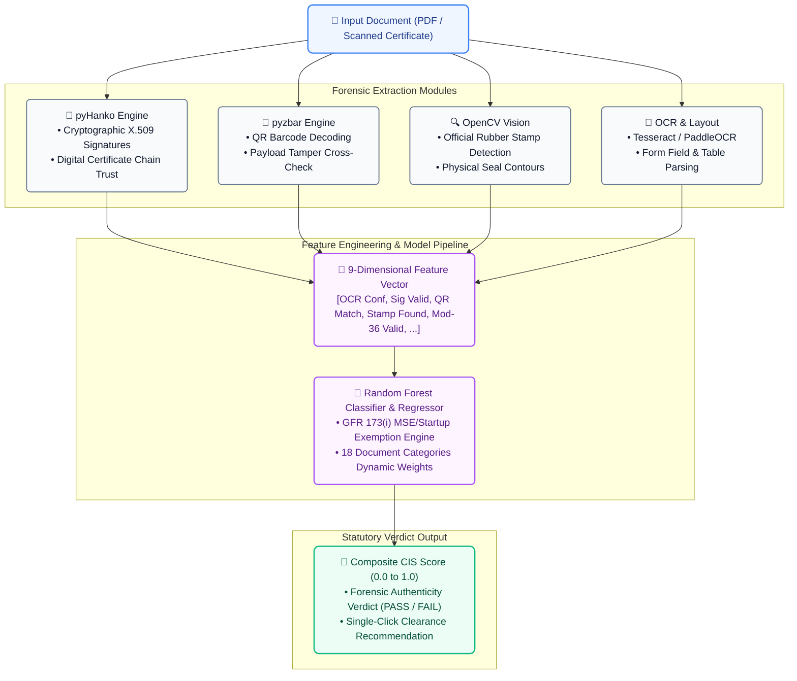

### 7.1 The 9-D Feature Vector
Every uploaded document is transformed into a standardized 9-dimensional mathematical feature vector for the Random Forest engine:
1. `ocr_confidence` (Float, 0.0–1.0): Mean character recognition confidence.
2. `digital_signature_valid` (Boolean, 0 or 1): Validity of embedded cryptographic certificate.
3. `qr_code_detected` (Boolean, 0 or 1): Presence of machine-readable 2D barcode.
4. `qr_payload_matched` (Boolean, 0 or 1): Visual text identity matching signed QR payload.
5. `stamp_detected` (Boolean, 0 or 1): Optical detection of circular/rectangular government stamps.
6. `taxpayer_checksum_valid` (Boolean, 0 or 1): Mod-36 verification of 15-character GSTIN.
7. `date_consistency_score` (Float, 0.0–1.0): Chronological validity (issue date vs expiry vs tender submission).
8. `mandatory_fields_present` (Float, 0.0–1.0): Ratio of required statutory fields identified.
9. `tamper_anomaly_score` (Float, 0.0–1.0): Font inconsistency, pixel density variation, and compression artifacts.

### 7.2 18 Indian Procurement Document Categories
The Dynamic CIS Engine supports weighted evaluation across 18 specialized document classes:
- GST Registration Certificate (06/07/08/09/27 series)
- Permanent Account Number (PAN) Card
- Udyam MSME Registration Certificate
- Audited Balance Sheet & Profit & Loss Statement (3 consecutive financial years)
- CA Turnover Certificate with unique **UDIN (Unique Document Identification Number)**
- Net Worth Certificate
- Solvency Certificate from Scheduled Commercial Bank
- Experience / Past Performance Completion Certificate
- OEM (Original Equipment Manufacturer) Authorization Certificate
- Make in India Local Content Statutory Declaration (Class-I / Class-II)
- Land Border Sharing Rule 144(xi) Undertaking
- Non-Blacklisting / Non-Debarment Affidavit
- Integrity Pact (CVC prescribed format)
- EMD (Earnest Money Deposit) / Bid Security Declaration
- Technical Datasheet & Compliance Matrix
- ISO 9001 / ISO 27001 Quality & Security Certifications
- Power of Attorney / Board Resolution for Authorized Signatory
- Partnership Deed / Certificate of Incorporation (MCA)

---

## 8. Vector Database & Generative AI RAG Architecture

The Node.js microservice (`ai-services`) implements a live Retrieval Augmented Generation pipeline backed by **PostgreSQL `pgvector`**:

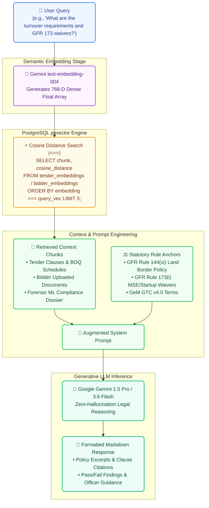

### 8.1 Embeddings Schema & Indexes
- **Model**: Google Gemini `text-embedding-004` (768 dimensions).
- **Distance Metric**: Cosine Distance (`<=>`).
- **Chunking Strategy**: Recursive Character Text Splitter with `chunkSize: 1000` and `chunkOverlap: 200`.
- **Database Tables**:
  - `tender_embeddings`: `(id, tender_id, title, content, embedding vector(768), metadata, created_at)`
  - `bidder_embeddings`: `(id, bidder_id, document_id, document_type, content, embedding vector(768), metadata)`
  - `summary_embeddings`: `(id, identifier, content, embedding vector(768), metadata)`

---

## 9. Database Schema & Entity-Relationship (ER) Diagram

The system uses **PostgreSQL 16** hosted on serverless NeonDB. The relational model links officers, commercial bidders, physical tender documents, compliance vaults, submissions, pre-validation government registries, and vector embeddings:

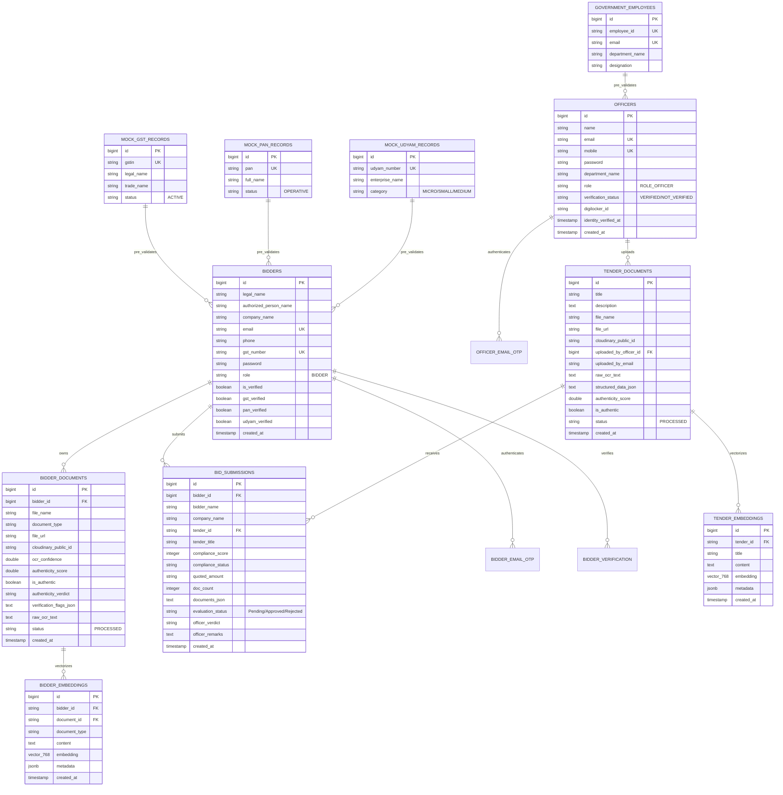

---

## 10. Consolidated API Catalog & Endpoints

### 10.1 Commercial Bidder Authentication & Profile (`/api/bidder`)
| Method | Endpoint | Description | Auth Required |
| :--- | :--- | :--- | :--- |
| `POST` | `/api/bidder/auth/signup` | Register company, check duplicate GSTIN, send Brevo OTP | None |
| `POST` | `/api/bidder/auth/verify-otp` | Verify 6-digit OTP, create DB user, issue Bearer JWT | None |
| `POST` | `/api/bidder/auth/resend-otp` | Re-dispatch registration OTP | None |
| `POST` | `/api/bidder/auth/login` | Authenticate bidder with email and password | None |
| `POST` | `/api/bidder/auth/verify-token` | Validate JWT token integrity and expiration | None |
| `POST` | `/api/bidder/auth/forgot-password`| Send password reset OTP | None |
| `POST` | `/api/bidder/auth/reset-password` | Finalize password reset with temporary reset token | None |
| `GET`  | `/api/bidder/{id}` | Fetch bidder organization profile | Bearer JWT |

### 10.2 Bidder Document Management & Vault (`/api/bidder/documents`)
| Method | Endpoint | Description | Auth Required |
| :--- | :--- | :--- | :--- |
| `POST` | `/api/bidder/documents/upload` | Multipart upload to Cloudinary & run forensic ML checks | Bearer JWT |
| `GET`  | `/api/bidder/documents` | Retrieve all vault documents uploaded by authenticated bidder | Bearer JWT |
| `GET`  | `/api/bidder/documents/{id}` | Get specific document with OCR & authenticity details | Bearer JWT |
| `DELETE`| `/api/bidder/documents/{id}`| Remove document from database and Cloudinary storage | Bearer JWT |
| `POST` | `/api/bidder/documents/check-cis`| Pre-submission CIS compliance check against tender clauses | Bearer JWT |
| `POST` | `/api/bidder/documents/scan-taxpayer`| Multipart upload instant GSTIN/PAN scanner | Bearer JWT |
| `POST` | `/api/bidder/documents/verify-taxpayer`| Verify taxpayer identifier status via live GST portal | Bearer JWT |
| `POST` | `/api/bidder/documents/audit-submission`| Autonomous audit with GFR 173(i) MSE exemption rules | Bearer JWT |
| `POST` | `/api/bidder/documents/submit-bid`| Submit formal tender application with price quote | Bearer JWT |
| `GET`  | `/api/bidder/documents/my-bids`| Retrieve all submitted bids and real-time evaluation status | Bearer JWT |

### 10.3 Procurement Officer & Tender Management (`/api/officer/tenders`)
| Method | Endpoint | Description | Auth Required |
| :--- | :--- | :--- | :--- |
| `POST` | `/api/officer/auth/initiate` | Verify government employee ID (EMP101) & department | None |
| `POST` | `/api/officer/auth/signup` | Register officer and dispatch verification OTP | None |
| `POST` | `/api/officer/auth/login` | Officer sign-in returning `ROLE_OFFICER` JWT | None |
| `POST` | `/api/officer/auth/mock-verify` | Certify officer identity with MeriPehchaan/DigiLocker | None |
| `POST` | `/api/officer/tenders/upload` | Upload tender notice PDF, Cloudinary store & ML extract | Bearer JWT (Officer) |
| `GET`  | `/api/officer/tenders` | List tenders published by the logged-in officer | Bearer JWT (Officer) |
| `GET`  | `/api/officer/tenders/{id}` | Get tender details, raw OCR text & parsed requirements | Bearer JWT (Officer) |
| `DELETE`| `/api/officer/tenders/{id}`| Delete tender and associated Cloudinary assets | Bearer JWT (Officer) |
| `POST` | `/api/officer/tenders/{id}/compare-bidders`| Multi-bidder comparative evaluation matrix | Bearer JWT (Officer) |
| `GET`  | `/api/officer/tenders/{id}/top-bidders`| Ranked top bidders evaluated for a specific tender | Bearer JWT (Officer) |
| `GET`  | `/api/officer/tenders/submissions` | Retrieve all real-time bid submissions across tenders | Bearer JWT (Officer) |
| `GET`  | `/api/officer/tenders/{id}/submissions` | Retrieve submissions for a specific tender | Bearer JWT (Officer) |
| `PUT`  | `/api/officer/tenders/submissions/{subId}/evaluate`| Update evaluation status (Approved/Rejected) & remarks | Bearer JWT (Officer) |

### 10.4 Python ML Microservice (13 Endpoints at `http://20.40.44.184`)
| Endpoint | Method | Input / Mode | Functionality |
| :--- | :--- | :--- | :--- |
| `/` | `GET` | Web Browser | Microservice status dashboard |
| `/health` | `GET` | None | Operational health & live GST portal ping |
| `/api/ml/document-types` | `GET` | None | 18 procurement doc categories & CIS weights |
| `/api/ml/process-document` | `POST` | Multipart PDF | OCR + Layout + Classification + NER + Tamper check |
| `/api/ml/automate-all` | `POST` | JSON payload | Master tender audit (Tender specs + Bidder profile) |
| `/api/ml/automate-all-files` | `POST`| Multipart Batch | Batch multi-document audit (PDFs + Tender notice) |
| `/api/ml/overall-summary` | `GET` | Query params | Single GET comprehensive dossier & RAG context |
| `/api/ml/verify-document` | `POST` | Multipart or JSON | pyHanko digital signatures + OpenCV stamp + QR decode |
| `/api/ml/verify-taxpayer` | `POST` | JSON (GSTIN/PAN) | Mod-36 checksum, state mapping & live GST lookup |
| `/api/ml/tender-requirements` | `POST`| JSON (Tender Text)| Dynamic 6-pillar parsing & GFR 173(i) MSE waivers |
| `/api/ml/process-clearance` | `POST` | JSON | Single-Click Clearance decision & risk scoring |
| `/api/ml/compliance/predict` | `POST` | JSON (9-D Vector)| Random Forest compliance verdict forecast |
| `/api/ml/train/all` | `POST` | JSON (Epochs) | Hot-reloading ML model retraining pipeline |

### 10.5 Node.js AI RAG & Gemini Chatbot
| Method | Endpoint | Description |
| :--- | :--- | :--- |
| `GET`  | `/health` | RAG service and database connectivity check |
| `POST` | `/api/ai/tender/process` | Download tender PDF, chunk text, embed into `tender_embeddings` |
| `POST` | `/api/ai/bidder/process` | Vectorize bidder certificates into `bidder_embeddings` |
| `POST` | `/api/ai/bidder-tender-chat/ask` | Contextual question answering over Tender + Bidder context chunks |
| `POST` | `/api/ai/compare/chat` | Multi-bidder comparative tabular evaluation with Gemini 1.5 Pro |
| `POST` | `/api/ai/bidder-chat/ask` | Bidder-facing compliance and eligibility inquiry assistant |
| `POST` | `/api/ai/copilot/ask` | Global GeM CompliFlix AI platform copilot for procurement rules |

---

## 11. Statutory Compliance & Regulatory Rules Engine

GeM CompliFlix AI embeds Indian statutory public procurement regulations directly into its validation code:

### 11.1 General Financial Rules (GFR) 2017
- **Rule 144(xi)**: Mandatory restriction on procurement from countries sharing a land border with India. Bidders must upload a certified declaration confirming OEM and supply chain origin compliance.
- **Rule 151**: Automatic debarment filter cross-referencing national debarment / blacklist databases.
- **Rule 170 / 173(i)**: Statutory exemption of **EMD (Earnest Money Deposit)** and **Past Turnover / Experience** requirements for certified Micro & Small Enterprises (MSEs) and DPIIT-recognized Startups, provided technical competency is established.

### 11.2 DPIIT Public Procurement (Preference to Make in India) Order
- **Class-I Local Supplier**: Local content >= 50%. Entitled to purchase preference over non-local suppliers within the L1 + 20% margin.
- **Class-II Local Supplier**: Local content >= 20% but < 50%. Eligible to participate but no purchase preference.
- **Non-Local Supplier**: Local content < 20%. Excluded from domestic tenders up to INR 200 Crores (Rule 161(iv)).

### 11.3 Quality and Cost Based Selection (QCBS) Formula
For tenders requiring technical evaluation alongside commercial bids:
$$\text{Composite Score } (S) = (T_s \times W_t) + \left(\frac{C_{\text{low}}}{C} \times W_f \times 100\right)$$
Where:
- $T_s$ = Evaluated Technical Compliance Score (0–100)
- $W_t$ = Technical Weight (typically 0.70 or 70%)
- $C$ = Quoted Bid Price
- $C_{\text{low}}$ = Lowest Valid Commercial Offer (L-1)
- $W_f$ = Financial Weight (typically 0.30 or 30%)

---

## 12. Deployment, Infrastructure & Security

### 12.1 Infrastructure Topology
- **Frontend SPA**: React 18 + Vite deployed on **Vercel**.
- **Core Backend**: Spring Boot 3.x Docker container deployed on **Render**.
- **AI RAG Microservice**: Node.js + Express Docker container deployed on **Render**.
- **ML Microservice**: Python FastAPI / scikit-learn container deployed on **Azure Cloud VPS**.
- **Database**: PostgreSQL 16 on **NeonDB Serverless** with pooled HikariCP connections and `pgvector` enabled.
- **Media Assets**: **Cloudinary** secure storage bucket with access signed keys.

### 12.2 Security Best Practices Implemented
1. **Zero Root Privilege**: Multi-stage Docker containers execute under dedicated non-root users (`spring:spring` and `node:node`).
2. **Password Security**: Passwords hashed with BCrypt (strength 12) with zero plaintext persistence.
3. **Dual JWT Filters**: Strict cryptographic validation of Bearer tokens with separate subject parsing for officers and commercial bidders.
4. **Rate Limiting**: Sliding window rate limiting on sensitive authentication routes (`RateLimiterFilter` - 5 requests / 60 seconds per IP) to mitigate brute force attacks.
5. **CORS Governance**: Configured Cross-Origin Resource Sharing with whitelisted origins, credential sharing, and 3600-second preflight caching.
6. **Statutory Non-Repudiation**: Officer clearance actions recorded with unique timestamped clearance IDs and audit trail remarks.

---

## 13. Testing, Verification & Quality Assurance Suite

The project includes automated regression testing and validation suites:
- **Client Testing Framework**: Jest 29 + Babel + React Testing Library configured in `Client/jest.config.cjs`.
- **Unit & Integration Tests**:
  - `tenderComparisonAdapter.test.js`: Verifies transformation of complex ML matrices into UI comparison tables.
  - `documentService.test.js`: Validates multipart file uploads, error handling, and Cloudinary response parsing.
  - `tenderService.test.js`: Tests real-time bid fetching, ranking computations, and status filtering.
  - `roleUtils.test.js`: Confirms strict RBAC boundary checks between officers and bidders.
  - `DocumentPreviewModal.test.jsx`: Tests blob URL generation, SHA-256 copy action, and tab switching.
- **Code Quality**: ESLint configuration enforcing ECMAScript modern standards and strict React hooks lint rules.

*Authored for the Smart India Hackathon (SIH) 2026 Evaluation Committee — GeM CompliFlix Engineering Team.*

